# CI/CD Pipeline for CloudFormation Stack

## Introduction

Create a CodePipeline that automates stack creation and updating of CloudFormation templates.

## Diagram



## How to run

### Create CodeCommit Repository

```sh
aws cloudformation create-stack --region ap-northeast-1 --stack-name approvetest-codecommit --template-body file://approvetest-codecommit.yml
```

### Update CodeCommit Repository

```sh
aws cloudformation update-stack --region ap-northeast-1 --stack-name approvetest-codecommit --template-body file://approvetest-codecommit.yml
```

### Create CodePipeline

```sh
aws cloudformation create-stack --region ap-northeast-1 --stack-name approvetest-codepipeline --template-body file://approvetest-codepipeline.yml --capabilities CAPABILITY_NAMED_IAM
```

### Update CodePipeline

```sh
aws cloudformation update-stack --region ap-northeast-1 --stack-name approvetest-codepipeline --template-body file://approvetest-codepipeline.yml --capabilities CAPABILITY_NAMED_IAM
```

## How to clean up

Delete stacks in the following order, taking into account dependencies between stacks.

### Clean up CodePipeline

Delete objects and deletion markers in the bucket in advance.

```sh
aws cloudformation delete-stack --region ap-northeast-1 --stack-name approvetest-codepipeline
```

### Clean up CodeCommit Repository

```sh
aws cloudformation delete-stack --region ap-northeast-1 --stack-name approvetest-codecommit
```
