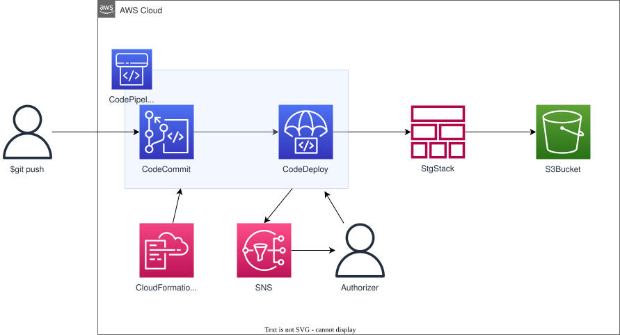

# CI/CD Pipeline for CloudFormation Stack

## Overview

This repository contains **AWS CodePipeline** templates for **automated CloudFormation stack deployment** with **manual approval gates**. It implements a multi-stage CI/CD pipeline with:

- **Source**: CodeCommit repository
- **Staging**: Automatic test environment deployment
- **Approval**: Manual review gate for production changes
- **Production**: Automatic production deployment

### Architecture

1. **CodeCommit** - Version control for CloudFormation templates
2. **CodePipeline** - Orchestration of deployment stages
3. **CloudFormation** - Infrastructure deployment
4. **SNS** - Approval notifications

### Use Cases

- Automating CloudFormation template deployments
- Implementing approval workflows for infrastructure changes
- Reducing manual deployment steps (Infrastructure as Code)
- Multi-environment (staging/production) deployments
- Learning AWS CI/CD best practices

### Blog Posts

📝 **Japanese articles:**
- [2024-09-09 版 - CodePipelineで承認プロセス追加](https://www.jesuke.com/blog/2024-09-09_codepipelineaws-cloudformation%E7%94%A8cicd%E3%83%91%E3%82%A4%E3%83%97%E3%83%A9%E3%82%A4%E3%83%B3%E3%81%AB%E6%89%BF%E8%AA%8F%E3%83%97%E3%83%AD%E3%82%BB%E3%82%B9%E3%82%92%E8%BF%BD%E5%8A%A0%E3%81%97%E3%81%9F%E3%81%84/)
- [2024-02-14 版 - CodePipelineで承認プロセス追加](https://www.jesuke.com/blog/2024-02-14_codepipelineaws-cloudformation%E7%94%A8cicd%E3%83%91%E3%82%A4%E3%83%97%E3%83%A9%E3%82%A4%E3%83%B3%E3%81%AB%E6%89%BF%E8%AA%8F%E3%83%97%E3%83%AD%E3%82%BB%E3%82%B9%E3%82%92%E8%BF%BD%E5%8A%A0%E3%81%97%E3%81%9F%E3%81%84/)

## Diagram



## How to run

### Create CodeCommit Repository

```sh
aws cloudformation create-stack --region ap-northeast-1 --stack-name approvetest-codecommit --template-body file://approvetest-codecommit.yml
```

### Update CodeCommit Repository

```sh
aws cloudformation update-stack --region ap-northeast-1 --stack-name approvetest-codecommit --template-body file://approvetest-codecommit.yml
```

### Create CodePipeline

```sh
aws cloudformation create-stack --region ap-northeast-1 --stack-name approvetest-codepipeline --template-body file://approvetest-codepipeline.yml --capabilities CAPABILITY_NAMED_IAM
```

### Update CodePipeline

```sh
aws cloudformation update-stack --region ap-northeast-1 --stack-name approvetest-codepipeline --template-body file://approvetest-codepipeline.yml --capabilities CAPABILITY_NAMED_IAM
```

## How to clean up

Delete stacks in the following order, taking into account dependencies between stacks.

### Clean up CodePipeline

Delete objects and deletion markers in the bucket in advance.

```sh
aws cloudformation delete-stack --region ap-northeast-1 --stack-name approvetest-codepipeline
```

### Clean up CodeCommit Repository

```sh
aws cloudformation delete-stack --region ap-northeast-1 --stack-name approvetest-codecommit
```
