# EKS Handson CloudFormation

## Introduction

Below are the steps to build an EKS cluster in the Osaka region using CloudFormation.

## Diagram



## How to run and clean up

### create vpc

```sh
aws cloudformation create-stack --region ap-northeast-3 --stack-name eks-handson-vpc --template-body file://eks-handson-vpc.yml
```

### create eks cluster

```sh
aws cloudformation create-stack --region ap-northeast-3 --stack-name eks-handson-cluster --template-body file://eks-handson-cluster.yml --capabilities CAPABILITY_NAMED_IAM
```

#### update vpc

```sh
aws cloudformation update-stack --region ap-northeast-3 --stack-name eks-handson-vpc --template-body file://eks-handson-vpc.yml
```

#### update eks cluster

```sh
aws cloudformation update-stack --region ap-northeast-3 --stack-name eks-handson-cluster --template-body file://eks-handson-cluster.yml
```

### clean up eks cluster

```sh
aws cloudformation delete-stack --region ap-northeast-3 --stack-name eks-handson-cluster
```

### clean up vpc

```sh
aws cloudformation delete-stack --region ap-northeast-3 --stack-name eks-handson-vpc
```
