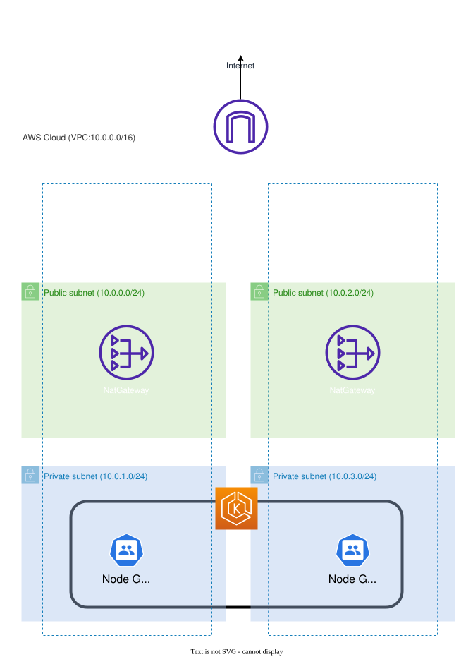

# EKS Handson CloudFormation

## Overview

This repository contains CloudFormation templates to build an **EKS (Elastic Kubernetes Service) cluster** on AWS. You can quickly set up a production-ready Kubernetes cluster infrastructure in the Osaka region (ap-northeast-3).

### Use Cases

- Learning Kubernetes on AWS
- Setting up test/development EKS environments
- Understanding CloudFormation infrastructure-as-code patterns
- Building Kubernetes clusters without `eksctl`

### Blog Posts

📝 **Japanese articles:**
- [2024-09-09 版 - EKSクラスターをAWS CloudFormationで構築したい](https://www.jesuke.com/blog/2024-09-09_kuberneteseks%E3%82%AF%E3%83%A9%E3%82%B9%E3%82%BF%E3%83%BC%E3%82%92aws-cloudformation%E3%81%A7%E6%A7%8B%E7%AF%89%E3%81%97%E3%81%9F%E3%81%84/)
- [2024-02-04 版 - EKSクラスターをAWS CloudFormationで構築したい](https://www.jesuke.com/blog/2024-02-04_kuberneteseks%E3%82%AF%E3%83%A9%E3%82%B9%E3%82%BF%E3%83%BC%E3%82%92aws-cloudformation%E3%81%A7%E6%A7%8B%E7%AF%89%E3%81%97%E3%81%9F%E3%81%84/)

## Diagram



## How to run and clean up

### create vpc

```sh
aws cloudformation create-stack --region ap-northeast-3 --stack-name eks-handson-vpc --template-body file://eks-handson-vpc.yml
```

### create eks cluster

```sh
aws cloudformation create-stack --region ap-northeast-3 --stack-name eks-handson-cluster --template-body file://eks-handson-cluster.yml --capabilities CAPABILITY_NAMED_IAM
```

#### update vpc

```sh
aws cloudformation update-stack --region ap-northeast-3 --stack-name eks-handson-vpc --template-body file://eks-handson-vpc.yml
```

#### update eks cluster

```sh
aws cloudformation update-stack --region ap-northeast-3 --stack-name eks-handson-cluster --template-body file://eks-handson-cluster.yml
```

### clean up eks cluster

```sh
aws cloudformation delete-stack --region ap-northeast-3 --stack-name eks-handson-cluster
```

### clean up vpc

```sh
aws cloudformation delete-stack --region ap-northeast-3 --stack-name eks-handson-vpc
```
