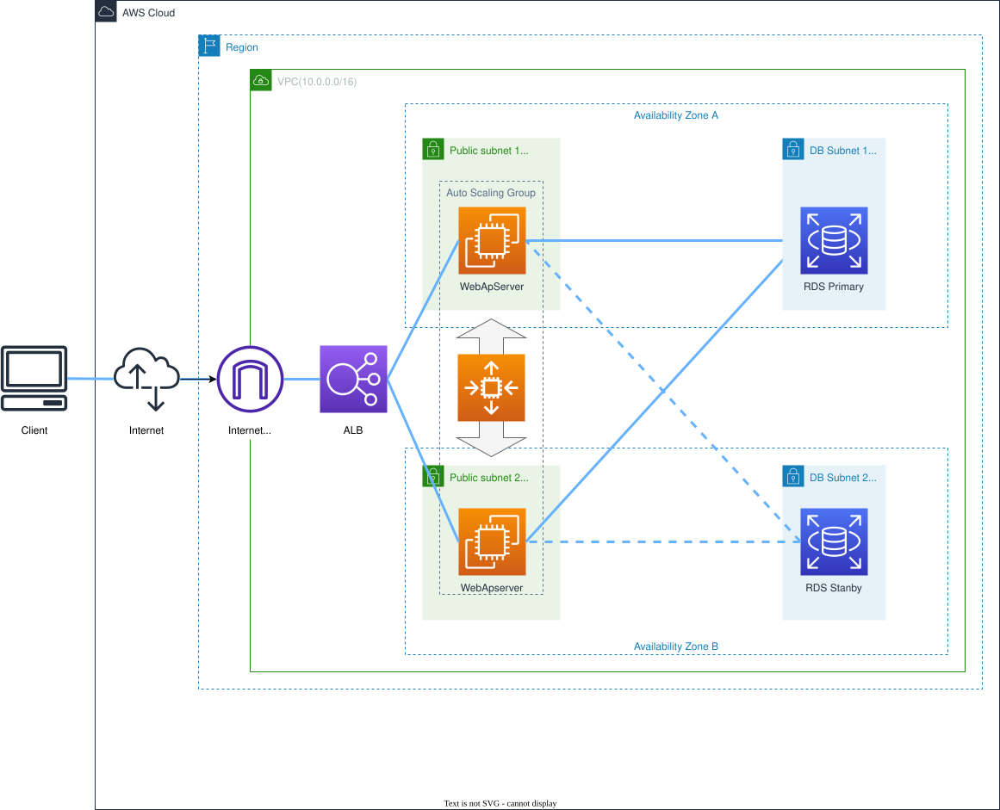

# nestedstack-basic-struct-autoscaling

## Overview

This repository contains **CloudFormation Nested Stack templates** for building a production-ready **3-tier web architecture with auto-scaling**. The example is based on WordPress hosting but can be adapted for any web application.

### Architecture

- **Tier 1**: ALB (Application Load Balancer)
- **Tier 2**: EC2 Auto Scaling Group with WordPress
- **Tier 3**: RDS MySQL Database + EFS for shared storage

### Use Cases

- Setting up WordPress hosting on AWS
- Learning CloudFormation Nested Stacks
- Building scalable web application infrastructure
- Understanding Infrastructure as Code (IaC) patterns
- Rapid infrastructure provisioning (⚡ ~20 minutes)

### Blog Posts

📝 **Japanese articles:**
- [2024-09-09 版 - Nested Stackで爆速構築](https://www.jesuke.com/blog/2024-09-09_nestedstackweb3%E5%B1%A4%E3%81%AE%E3%82%AA%E3%83%BC%E3%83%88%E3%82%B9%E3%82%B1%E3%83%BC%E3%83%AA%E3%83%B3%E3%82%B0%E6%A7%8B%E6%88%90%E3%82%92cloudformation%E3%81%A7%E7%88%86%E9%80%9F%E6%A7%8B%E7%AF%89%E3%81%97%E3%81%9F%E3%81%84/)
- [2024-03-02 版 - Nested Stackで爆速構築](https://www.jesuke.com/blog/2024-03-02_nestedstackweb3%E5%B1%A4%E3%81%AE%E3%82%AA%E3%83%BC%E3%83%88%E3%82%B9%E3%82%B1%E3%83%BC%E3%83%AA%E3%83%B3%E3%82%B0%E6%A7%8B%E6%88%90%E3%82%92cloudformation%E3%81%A7%E7%88%86%E9%80%9F%E6%A7%8B%E7%AF%89%E3%81%97%E3%81%9F%E3%81%84/)

## Diagram



## How to run and clean up

### 1.cloudformation template bucket

create/update/delete

```sh
aws cloudformation create-stack --region ap-northeast-1 --stack-name test-cfn-template-bucket --template-body file://test-cfn-template-bucket.yml
aws cloudformation update-stack --region ap-northeast-1 --stack-name test-cfn-template-bucket --template-body file://test-cfn-template-bucket.yml
aws cloudformation delete-stack --region ap-northeast-1 --stack-name test-cfn-template-bucket
```

### 2.cloudformation create root stack

create/update/delete

```sh
aws cloudformation create-stack --region ap-northeast-1 --stack-name test-root-stack --template-body file://test-root-stack.yml --capabilities CAPABILITY_NAMED_IAM
aws cloudformation update-stack --region ap-northeast-1 --stack-name test-root-stack --template-body file://test-root-stack.yml
aws cloudformation delete-stack --region ap-northeast-1 --stack-name test-root-stack
```
